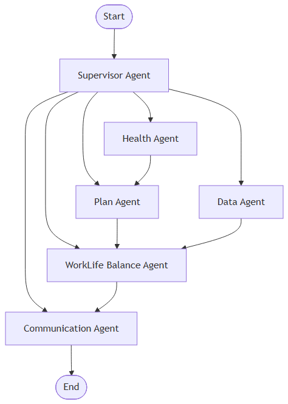

# 🤖 Plandy AI 에이전트 시스템

## 📋 프로젝트 개요

**Plandy**는 직장인을 위한 AI 일정·워라벨 관리 비서로, 다중 에이전트 시스템을 통해 사용자의 일정을 실시간으로 관리하고 워라벨 균형을 유지하는 것을 목표로 합니다.

### 🎯 핵심 목표
- **실시간 일정 재조정**: 상황 변화에 따른 유연한 일정 관리
- **워라벨 균형 관리**: 업무와 개인 시간의 균형점 찾기
- **습관 추적 및 개선**: 개인 습관 패턴 분석 및 개선 제안
- **지능형 소통 시스템**: 컨텍스트 기반 맞춤형 대화

---

## 🏗️ AI 에이전트 아키텍처

### LangGraph 기반 노드-엣지 구조



**시스템 플로우:**
- **Start** → **Supervisor Agent** (중앙 조정자)
- **Supervisor Agent**가 다음 에이전트들로 작업 분배:
  - **Health Agent** (건강 상태 모니터링)
  - **Plan Agent** (일정 계획 수립)  
  - **Data Agent** (데이터 수집 및 분석)
  - **WorkLife Balance Agent** (워라벨 균형 관리)
  - **Communication Agent** (사용자 소통)
- **Health Agent** → **Plan Agent** (건강 정보 기반 일정 조정)
- **Plan Agent** + **Data Agent** → **WorkLife Balance Agent** (종합적 워라벨 관리)
- **WorkLife Balance Agent** → **Communication Agent** (최종 사용자 소통)
- **Communication Agent** → **End** (프로세스 완료)

### 그래프 워크플로우
- **노드**: 각 에이전트가 독립적인 노드로 구현
- **엣지**: 에이전트 간 정보 전달 및 워크플로우 정의
- **라우팅**: Supervisor가 사용자 요청에 따라 적절한 에이전트로 라우팅
- **상태 관리**: 중앙화된 State 객체를 통한 정보 공유

### 🔄 에이전트별 역할 및 책임

#### 1. **SupervisorAgent** (중앙 조정자)
- **역할**: 전체 시스템의 중앙 조정 및 의사결정
- **책임**:
  - 다른 에이전트들의 작업 조율
  - 우선순위 결정 및 리소스 할당
  - 시스템 상태 모니터링
  - 에러 처리 및 복구

#### 2. **HealthAgent** (건강 상태 모니터링)
- **역할**: 사용자의 건강 상태 및 습관 패턴 분석
- **책임**:
  - 습관 로그 분석
  - 건강 지표 추적
  - 스트레스 레벨 모니터링
  - 건강 관련 알림 생성

#### 3. **PlanAgent** (일정 계획 수립)
- **역할**: 일정 생성, 최적화, 재조정
- **책임**:
  - 초기 일정 생성
  - 실시간 일정 재조정
  - 우선순위 기반 작업 배치
  - 마감일 및 제약조건 고려

#### 4. **DataAgent** (데이터 수집 및 분석)
- **역할**: 사용자 데이터 수집 및 패턴 분석
- **책임**:
  - 사용자 행동 패턴 분석
  - 성과 지표 추적
  - 피드백 데이터 수집
  - 데이터 기반 인사이트 생성

#### 5. **WorkLifeBalanceAgent** (워라벨 균형 관리)
- **역할**: 업무와 개인 시간의 균형 관리
- **책임**:
  - 워라벨 점수 계산
  - 업무/휴식 시간 비율 분석
  - 균형 개선 제안
  - 주간/월간 레벨 평가

#### 6. **CommunicationAgent** (사용자 소통)
- **역할**: 사용자와의 자연스러운 소통
- **책임**:
  - 채팅 인터페이스 관리
  - 상황별 맞춤형 응답
  - 사용자 피드백 수집
  - 대화 컨텍스트 관리

---

## 🛠️ 도구(Tools) 시스템

### 도구별 기능

#### 1. **TimeTools** (시간 관리 도구)
- 현재 시간 조회
- 시간 차이 계산
- 시간 더하기/빼기
- 시간 형식 변환
- 시간대 변환
- 시간 유효성 검증

#### 2. **ScheduleTools** (스케줄링 도구)
- 작업 할당 및 배치
- 일정 재조정
- 일정 최적화
- 충돌 검사
- 사용 가능한 시간 제안
- 일정 유효성 검증

#### 3. **FeedbackTools** (피드백 도구)
- 피드백 수집 및 저장
- 피드백 분석 및 분류
- 감정 분석
- 인사이트 생성
- 트렌드 추적

---

## 📁 프로젝트 구조

```
flandy-ai/
├── agents/                    # AI 에이전트들
│   ├── __init__.py
│   ├── graph.py              # LangGraph 기반 그래프 구조
│   ├── nodes/                # 노드 구현
│   │   ├── __init__.py
│   │   ├── supervisor_node.py    # 중앙 조정 노드
│   │   ├── health_node.py        # 건강 모니터링 노드
│   │   ├── plan_node.py          # 일정 계획 노드
│   │   ├── data_node.py          # 데이터 분석 노드
│   │   ├── worklife_node.py      # 워라벨 관리 노드
│   │   └── communication_node.py # 사용자 소통 노드
│   ├── base_agent.py         # 기본 에이전트 클래스 (레거시)
│   ├── supervisor_agent.py   # 중앙 조정자 (레거시)
│   ├── health_agent.py       # 건강 모니터링 (레거시)
│   ├── plan_agent.py         # 일정 계획 (레거시)
│   ├── data_agent.py         # 데이터 분석 (레거시)
│   ├── worklife_balance_agent.py  # 워라벨 관리 (레거시)
│   └── communication_agent.py     # 사용자 소통 (레거시)
├── models/                    # 데이터 모델들
│   ├── __init__.py
│   └── state.py              # State 및 Task 모델
├── services/                  # 비즈니스 로직 서비스
│   ├── __init__.py
│   └── prompt_service.py     # 프롬프트 관리 서비스
├── tools/                     # 도구들
│   ├── __init__.py
│   ├── base_tool.py          # 기본 도구 클래스
│   ├── time_tools.py         # 시간 관리 도구
│   ├── schedule_tools.py     # 스케줄링 도구
│   └── feedback_tools.py     # 피드백 도구
├── utils/                     # 유틸리티 함수들
├── tests/                     # 테스트 코드
├── main.py                   # 메인 실행 파일
├── requirements.txt          # 의존성 목록
├── AI.md                     # 상세 설계 문서
└── README.md                 # 프로젝트 설명서
```

---

## 🚀 시작하기

### 필수 요구사항
- Python 3.8+
- LangGraph (AI 에이전트 프레임워크)
- LangChain (LLM 통합)
- Pydantic (데이터 검증)

### 설치 및 실행

1. **저장소 클론**
```bash
git clone <repository-url>
cd flandy-ai
```

2. **가상환경 생성 및 활성화**
```bash
python -m venv venv
source venv/bin/activate  # Windows: venv\Scripts\activate
```

3. **의존성 설치**
```bash
pip install -r requirements.txt
```

4. **환경 변수 설정**
```bash
# env.example 파일을 .env로 복사
cp env.example .env

# .env 파일을 편집하여 실제 API 키 입력
# OPENAI_API_KEY=your_actual_openai_api_key_here
```

5. **기본 실행 예제**
```python
import asyncio
from main import PlandyAISystem

async def main():
    # Plandy AI 시스템 초기화
    plandy_ai = PlandyAISystem()
    
    # 사용자 요청 처리
    result = await plandy_ai.process_request("오늘 건강 상태를 확인해주세요")
    print(result)
    
    # 시스템 종료
    await plandy_ai.shutdown()

if __name__ == "__main__":
    asyncio.run(main())
```

---

## ⚙️ 환경 변수 설정

### 필수 환경 변수
- `OPENAI_API_KEY`: OpenAI API 키 (필수)

### 선택적 환경 변수
- `TAVILY_API_KEY`: 웹 검색 기능용 API 키
- `DATABASE_URL`: 데이터베이스 연결 URL
- `REDIS_URL`: Redis 캐시/큐 연결 URL
- `LOG_LEVEL`: 로깅 레벨 (DEBUG, INFO, WARNING, ERROR)
- `LOG_FILE`: 로그 파일 경로

### 환경 변수 설정 방법
1. `env.example` 파일을 `.env`로 복사
2. `.env` 파일에서 실제 값으로 수정
3. API 키는 [OpenAI Platform](https://platform.openai.com/api-keys)에서 발급

---

## 📊 사용 예제

### 1. LangGraph 기반 시스템 실행

```python
from main import PlandyAISystem

# Plandy AI 시스템 초기화
plandy_ai = PlandyAISystem()

# 시스템 상태 확인
status = await plandy_ai.get_system_status()
print(f"그래프 타입: {status['graph_info']['type']}")
print(f"노드 수: {len(status['graph_info']['nodes'])}")
```

### 2. 시간 도구 사용

```python
from tools import TimeTools

time_tools = TimeTools()

# 현재 시간 조회
result = await time_tools.execute({
    "action": "now",
    "timezone": "Asia/Seoul",
    "format": "readable"
})

# 시간 차이 계산
diff_result = await time_tools.execute({
    "action": "diff",
    "time1": "2024-01-01T09:00:00",
    "time2": "2024-01-01T17:00:00"
})
```

### 3. 스케줄링 도구 사용

```python
from tools import ScheduleTools

schedule_tools = ScheduleTools()

# 작업 할당
result = await schedule_tools.execute({
    "action": "allocate",
    "tasks": [
        {
            "id": "task1",
            "title": "프로젝트 계획 수립",
            "duration": 120,
            "priority": 8
        }
    ],
    "constraints": {
        "working_hours": {"start": "09:00", "end": "18:00"},
        "break_times": ["12:00-13:00"]
    }
})
```

### 4. 피드백 도구 사용

```python
from tools import FeedbackTools

feedback_tools = FeedbackTools()

# 피드백 수집
result = await feedback_tools.execute({
    "action": "collect",
    "user_id": 1,
    "feedback_data": {
        "text": "일정 관리가 잘 되고 있어요!",
        "rating": 4.5,
        "category": "schedule"
    }
})
```

### 5. 프롬프트 서비스 사용

```python
from services import prompt_service

# 에이전트 간 정보 전달 프롬프트 생성
prompt = prompt_service.generate_prompt(
    from_agent="health_agent",
    to_agent="plan_agent",
    data={"health_score": 75.5, "stress_level": 6.2},
    state=current_state
)
```

---

## 🔧 개발 가이드라인

### 코드 품질
- PEP 8 코딩 표준 준수
- 함수별 상세 주석 (입력/출력/상위 로직 영향)
- 타입 힌트 사용
- 비동기 프로그래밍 패턴 적용

### 노드 개발
- LangGraph 기반 노드 함수로 구현
- `state: State` 매개변수를 받고 업데이트된 상태를 반환
- 에러 처리 및 로깅 구현
- 에이전트 간 정보 전달을 위한 프롬프트 서비스 활용

### 도구 개발
- `BaseTool` 클래스를 상속받아 구현
- `execute()`, `validate()`, `get_schema()` 메서드 필수 구현
- 입력 검증 및 에러 처리
- 스키마 정의 및 문서화

---

## 🧪 테스트

### 단위 테스트 실행
```bash
python -m pytest tests/
```

### 특정 에이전트 테스트
```bash
python -m pytest tests/test_agents/test_health_agent.py
```

### 특정 도구 테스트
```bash
python -m pytest tests/test_tools/test_time_tools.py
```

---

## 📈 성능 지표

### 기능적 지표
- 일정 재조정 정확도: >90%
- 워라벨 점수 개선율: >15%
- 사용자 만족도: >4.5/5.0
- 시스템 응답 시간: <2초

### 비즈니스 지표
- 사용자 유지율: >80%
- 일일 활성 사용자: 증가 추세
- 피드백 긍정 비율: >70%
- 기능 사용률: >60%

---

## 🚀 향후 확장 계획

### 단기 (3개월)
- 기본 에이전트 시스템 구현 완료
- 핵심 도구 개발 완료
- 사용자 테스트 및 피드백 수집

### 중기 (6개월)
- 고급 AI 기능 추가
- 모바일 앱 연동
- 팀 협업 기능

### 장기 (1년)
- 엔터프라이즈 버전
- API 마켓플레이스
- 글로벌 확장

---

## 🤝 기여하기

1. Fork the Project
2. Create your Feature Branch (`git checkout -b feature/AmazingFeature`)
3. Commit your Changes (`git commit -m 'Add some AmazingFeature'`)
4. Push to the Branch (`git push origin feature/AmazingFeature`)
5. Open a Pull Request

---

## 📝 라이선스

이 프로젝트는 MIT 라이선스 하에 배포됩니다. 자세한 내용은 `LICENSE` 파일을 참조하세요.

---

## 📞 연락처

- 프로젝트 링크: [https://github.com/your-username/flandy-ai](https://github.com/your-username/flandy-ai)
- 이메일: your-email@example.com

---

## 🙏 감사의 말

- 모든 기여자들에게 감사드립니다
- 오픈소스 커뮤니티의 지원에 감사드립니다

---

*이 문서는 Plandy AI 에이전트 시스템의 설계 및 구현 가이드입니다. 프로젝트 진행에 따라 지속적으로 업데이트됩니다.*
